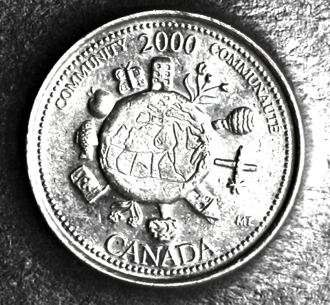

# Community

*     *     *     *  

**Designer:** Michelle Thibodeau

**Release Date:** December 2000

**Alternative Title:** Canada in the World

**Description:** This "coin portrays Canada's continuing leadership and contributions to the global community."

**Myth Depicted:** Myth of Peacekeeping via global citizenship

[View with RTI](https://mslafrenie.github.io/Community-2000-Coin/)

		
	

	
