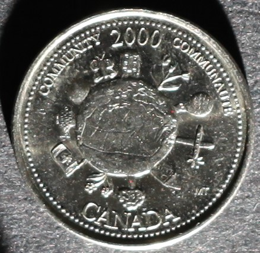

# Community

*     *     *     *  
**Unprocessed Photographic View**

While examining this coin consider the following:
- What elements of its design stand out most? 
- How would you describe this coin's design?
- What story is this coin narrating?

After exploring the unprocessed photographic view of this coin take a look at the RTI default view!

----
**RTI Default View:**


**Instructions for use:**
1) Click on the light bulb icon,
2) Drag cursor across image to move light position,
3) Select the question mark icon for further help.

----

Now that you have viewed both the unprocessed image and the RTI model, take a look at the background information for this coin and my close reading of the myth identified as part of its banal nationalistic power:

**Designer:** Michelle Thibodeau

**Release Date:** December 2000

**Alternative Title:** Canada in the World

**Description:** This "coin portrays Canada's continuing leadership and contributions to the global community."

**Myth Identified:** Myth of Peacekeeping via global citizenship

**My Close Reading:** 

*Excerpt from RTI Investigation:*

"We can unpack this myth through RTI, by visually and materially engaging with each aspect of the Community coin. Positioned directly in the middle, this design features a raised circle with a map of Canada clearly defined. In recognizing the map of Canada and the icons/imagery surrounding it, we can draw parallels to the familiar visuals of humanitarian projects—such as Hands Around the World and United Nations relief projects and funds—that this circle is indeed meant to symbolize the world or global community. What stands out the most about the Community coin under RTI investigation is the style of this design. Each icon on the coin, excluding the precise etching of Canada’s landmass appears to be drawn in a child-like or amateur style, which was part of the global citizenship appeal of the 1990s. In Canada, global citizenship, particularly in the 1990s and 2000s, was directed at youths in classrooms across the country and called on them to inspire change at local and global levels.[94]  

In switching to specular enhancement mode in the RTI Viewer and zooming in 200% we can examine the design style and materiality of this coin further. Through active re-lighting and continuously moving the simulated light source to suit our desired point of examination, we can achieve two feats: simulating the effect of the sun setting/rising around the world, which enhances the visual experience of the coin, and second, we can better determine the different textures and depths of each icon and the outline of the Canadian map. After identifying the icons surrounding the world, the design appears to be more confusing than before. How do these icons relate to Canada in the world? Perhaps the hot air balloon and airplane might symbolize connection to the global community? Do the floral and nature-based icons represent Canada’s role in environmental stewardship? After identifying the icons around the world, we are left with more questions than answers about the design and its description."

**NOTE:**
- [94] A prime example of the appeal of global citizenship to Canadian youths is ME to WE, formerly known as Free the Children. Founded in 1995 by 12-year-old Craig Kielburger, it went on to become a staple in Canadian classrooms regarding global citizenship and doing good abroad. It is also a prime example of the naiveté of global citizenship, given ME to WE’s recent and on-going history of harm and scandal. 

*Excerpt from Investigation of Myth:*

"For much of the late twentieth century, young Canadians understood their place in the global community through peacekeeping, acting as neutral intermediaries, and operating as a soft/middle power. These imaginings are reciprocal in nature because the way Canada imagines itself is often confirmed by its successful communication to and acceptance by the global community. In this sense, I refer to the power of Canada’s international image in reflecting and reinforcing a sense of Canadian identity domestically that is predicated on their perceived roles, mores, and values based in community-building and multiculturalism.[93]  

[...]

[The] myth presented by the Community coin has everything to do with how Canada perceived itself at the turn of the millennium and previously—it is a reflection what many wanted Canada to be at the time. So, what this coin asks its audience to do, is to forget or ignore all the ways in which Canada is complicit in the same or similar colonial and imperial acts as the nations it is lauded for intervening on behalf of and protecting."

**NOTE"**
- [93] Evan H. Potter, Branding Canada: Projecting Canada’s Soft Power through Public Diplomacy (Montreal: McGill-Queen’s University Press, 2014), 4.
