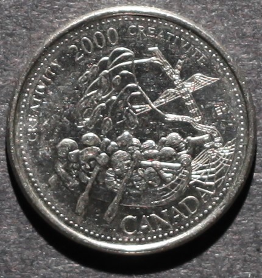

# Creativity

*     *     *     *  
**Unprocessed Photographic View**

While examining this coin consider the following:
- What elements of its design stand out most? 
- How would you describe this coin's design?
- What story is this coin narrating?

After exploring the unprocessed photographic view of this coin take a look at the RTI default view!

----
**RTI Default View:**


**Instructions for use:**
1) Click on the light bulb icon,
2) Drag cursor across image to move light position,
3) Select the question mark icon for further help.

----

Now that you have viewed both the unprocessed image and the RTI model, take a look at the background information for this coin and my close reading of the myth identified as part of its banal nationalistic power:

**Designer:** Eric (Kong Tat) Hui

**Release Date:** October 2000

**Alternative Title:** Expressions For All Time

**Description:** This "coin applauds the rich legacy of Canadian artistic expression past and future."

**Myth(s) Identified:** Myth of the Wilderness via the canoe, Myth of Indigenous Cultural Stagnation

**My Close Reading:** 

*Excerpt from RTI Investigation:*

"Although confusing to read initially, the details of the Creativity coin, particularly the faces of the paddlers and the unknown totem pole-esque figure, become easier to separate from the rest of the design through RTI analysis. Here, RTI does not enhance our viewing of the design as a cohesive picture, but instead enables a more thorough engagement with each element of the design independently. Designed as discrete representatives of Canadian art throughout “the millenniums” but positioned as one picture, RTI presents a unique opportunity to deconstruct the blending of art forms on this coin. 

 [...]
 
The first paddler appears to be wearing a hat of some sort that fits closely to their head. Examining their arm further we can see a flannel or plaid-like texture with an elbow patch. In the front of the canoe there appears to be a long-haired figure using binoculars or a spyglass. This figure might be looking at the terrain around them or into an unseen and unknown wilderness, their gaze is truly undetermined. However, a close reading of this individual might also imagine it as signifying a forward look to the future given the individual’s gaze and the way their canoe overlaps with the wire-frame on the right. Shifting our gaze toward the left, away from the person with binoculars, there appears to be someone holding an oblong object: maybe a flute or a spear? These figures are designed ambiguously and never elaborated on by Hui, the designer. Directly underneath the previous figure we can see two faces without bodies—could this be a way to indicate their status as children? The answer is unclear. If this is the case, we might also see the two paddlers at the back of the canoe as older or more mature than the two disembodied heads. Thus, through reading closely, we can use RTI to see and read each person in the canoe individually."

*Excerpt from Investigation of Myths:*

"[The] Creativity coin perpetuates myths of the North, myths of the wilderness, and myths of Indigenous cultural stasis: the idea that Indigenous peoples and their customs, art, lifestyles, and cultures are static and outdated. This trope or myth as defined by Robin Jarvis Brownlie constructs and positions Indigenous peoples “outside [of] history and renders them as mere relics of an earlier stage of human development that were doomed to be superseded by those who had taken their land.”[85] The key assumption at the core of this coin and Hui’s interpretation of Canadian creativity, is that Indigenous artwork and symbols are synonymous with Canadian creativity, but Indigenous peoples are not. Much like the landscape artwork of the Group of Seven that endeavours to link Canadian-ness with the wilderness—as seen in The Log Drive coin, and the Voyageurs coin—the Creativity coin works within this framework and envisions a future that is predicated on hegemonic and colonial myths of cultural progress and superiority.[86] This exclusion and erasure of Indigenous artists in the narrative of this design is further compounded by the erasure of Indigenous peoples from the very landscapes depicted in Group of Seven paintings."

**NOTES:**
- [85] Robin Jarvis Brownlie, “First Nations Perspectives and Historical Thinking in Canada,” in First Nations, First Thoughts: The Impact of Indigenous Thought in Canada, edited by Annis May Timpson (Vancouver, BC: UBC Press, 2009), 21-2.
- [86] Brownlie, “First Nations Perspectives,” 21.

