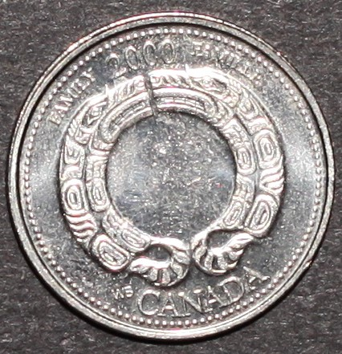

# Family

*     *     *     *  
**Unprocessed Photographic View**

While examining this coin consider the following:
- What elements of its design stand out most? 
- How would you describe this coin's design?
- What story is this coin narrating?

After exploring the unprocessed photographic view of this coin take a look at the RTI default view!

----
**RTI Default View:**


**Instructions for use:**
1) Click on the light bulb icon,
2) Drag cursor across image to move light position,
3) Select the question mark icon for further help.

----

Now that you have viewed both the unprocessed image and the RTI model, take a look at the background information for this coin and my close reading of the myth identified as part of its banal nationalistic power:

**Designer:** Wade Stephen Baker

**Release Date:** August 2000

**Alternative Title:** The Ties That Bind

**Description:** This "coin is a tribute to the family, the fabric of Canadian society, and depicts two wolves, symbols of togetherness."

**Myth(s) Resisted:** Myth of Indigenous Cultural Stagnation, Myths of Colonization and Broken Family Structures

**My Close Reading:** 

*Excerpt from RTI Investigation:*

"The closer we look with RTI, under specular enhancement, the more we see the minute and meticulous detail etched onto this coin. The style of the design appears mostly consistent, apart from the facial features which use finer lines than the rest of the body. This is especially clear when the simulated light source is positioned in the bottom left quadrant, roughly at the south-south-west position. From this angle the wolves’ teeth and eyes are illuminated completely, further enhancing the shape and form of the wolves, making them appear life-like. The wolf on the right even appears to be displaying emotion with a furrowed brow and bared teeth. But how does this serve our investigation? In taking the time to read this coin closely, we can imagine these wolves as three-dimensional, and we can ask new questions of these wolves: Why are they positioned in a circle? Are they protecting themselves or someone else? How are they related to each other? How do these wolves represent the designer’s family? By working with RTI to read this coin we can read the value of family in new ways and push back against the official description of the Family coin. If we see family as something to be protected, as a tie that binds us physically, and as a value to be projected into the future, we can begin to see this coin as a unit of family. By bringing us closer to the design, RTI encourages us to question what lies beyond the frame of this coin and to imagine that there might be other wolves and other ways to represent this value."

*Excerpt from Investigation of Myth:*

"Being one of only two coins in the entire 2000 campaign, Designing the Future, that explicitly references Indigeneity,[102] Baker’s design, The Ties That Bind, speaks to a broader conversation about Indigenous family structures and the importance Indigenous peoples writing their own stories. By participating in this future-oriented millennium series and drawing on his family’s past, Baker subverted the nation and took history-writing into his own hands. His design can then be understood as part of an ongoing practice of Indigenous peoples producing their own histories and writing “themselves into new societies in their lands and [naming] and [documenting] the wrongs of colonization.”[103] Through Baker’s ability to imagine a future where family is valued, especially Indigenous families, his design encourages us to ask: How have Indigenous understandings of family and kinship been devalued? And by asking this question we can situate his design within a longer history of Indigenous resilience and resistance to colonial violence and familial disruptions. So, in order to see a future where Indigenous families are valued, Canadians must understand the legacies of colonization and the disruptive systems—blood-quantum policies, forced sterilization, the residential school system, and the Sixties Scoop, to name only a few examples of colonial violence—that this coin resists."

**NOTES:**
- [102] In the 1999-series, “Drawing on our Past,” five coins directly referenced Indigeneity in Canada.
- [103] Brownlie, “First Nations Perspectives,” 23.
