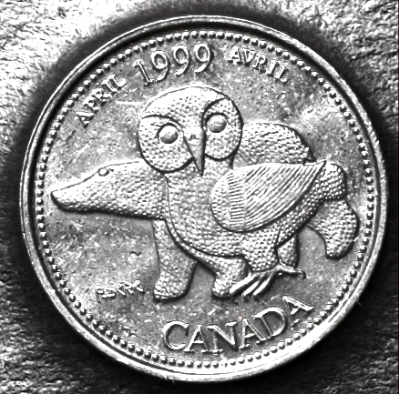

# Our Northern Heritage

*     *     *     *  

**Designer:** Kenojouak Ashevak

**Release Date:** April 1999

**Description:** This "coin is a tribute to contemporary Canadian Inuit art."

**Myth(s) Resisted:** Myth of the Wilderness, Myth of the North

					

[View with RTI](https://mslafrenie.github.io/April-99-Coin/)

		
	

	

  
