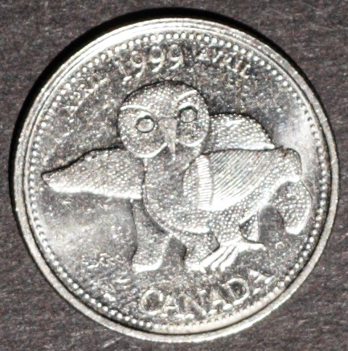

# Our Northern Heritage

*     *     *     *  
**Unprocessed Photographic View**

While examining this coin consider the following:
- What elements of its design stand out most? 
- How would you describe this coin's design?
- What story is this coin narrating?

After exploring the unprocessed photographic view of this coin take a look at the RTI default view!

----
**RTI Default View:**


**Instructions for use:**
1) Click on the light bulb icon,
2) Drag cursor across image to move light position,
3) Select the question mark icon for further help.

----

Now that you have viewed both the unprocessed image and the RTI model, take a look at the background information for this coin and my close reading of the myth identified as part of its banal nationalistic power:

**Designer:** Kenojuak Ashevak

**Release Date:** April 1999

**Description:** This "coin is a tribute to contemporary Canadian Inuit art."

**Myth(s) Resisted:** Myth of the Wilderness, Myth of the North

**My Close Reading:** 

*Excerpt from RTI Investigation:*

*Excerpt from Investigation of Myth:*

  
