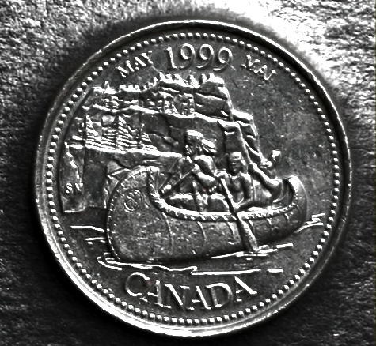

# The Voyageurs

*     *     *     *  

**Designer:** Sergiy Minenok

**Release Date:** May 1999

**Description:** This "coin depicts the voyageurs who travelled Canada's rivers by canoe to explore new lands and develop the fur trade."

**Myth Depicted:** Myth of the Wilderness via the canoe

[Access Web RTI Viewer](https://mslafrenie.github.io/May-99-Coin/)

		
	

	

