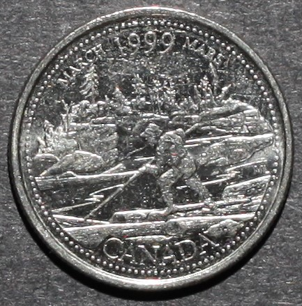

# The Log Drive 

*     *     *     *  
**Unprocessed Photographic View**

While examining this coin consider the following:
- What elements of its design stand out most? 
- How would you describe this coin's design?
- What story is this coin narrating?

After exploring the unprocessed photographic view of this coin take a look at the RTI default view!

----

**RTI Default View:**


**Instructions for use:**
1) Click on the light bulb icon,
2) Drag cursor across image to move light position,
3) Select the question mark icon for further help.

----

Now that you have viewed both the unprocessed image and the RTI model, take a look at the background information for this coin and my close reading of the myth identified as part of its banal nationalistic power:

**Designer:** Marjolaine Lavoie

**Release Date:** March 1999 

**Official Description:** This "coin depicts the courage and valiant contribution of the raftsmen to Canada's development and prosperity."

**Myth Identified:** Myth of the Wilderness

**My Close Reading:** 

*Excerpt from RTI Investigation:*

"Visually we can discern the differences between the foreground, the middle ground, and background. The materiality of the raftsman’s clothing and the environment also becomes clearer with this close examination—most of which is lost or clouded during traditional photographic investigations. Through RTI, we can see that the raftsman is wearing what looks like suspenders (the straps visible down the middle of his back), a t-shirt with rolled up sleeves, tall work boots, and a hat. Looking closer at his physical attributes we can infer his strength due to his muscular body and his role of driving logs down river. The RTI technique invites new interpretations and examination of The Log Drive coin by presenting depth, both literally and figuratively, to the stories, details, and materiality of the coin design. It enables us to immerse ourselves in, and to fully see, the coin design as a snapshot of a scene that might have occurred–it reanimates the raftsman and removes the “noise” or distractions of the coin’s materiality such as dents, contrast, and blurriness."

*Excerpt from Investigation of Myth:*

"Entrenched in colonial narratives of nation-building, this coin celebrates the lumber industry and the settlers who dominated and controlled Canadian trade. Certainly, lumber, considered by some to be a staple, was a key industry for many parts of British North America in the nineteenth century. As part of his Staples thesis, [50] Harold Innis argues that the exploitation of specific industries (i.e. fur, lumber, wheat, cotton, meat) acted as a catalyst for major economic and infrastructural developments in the nineteenth century such as railroads, trade networks and canal systems.  While Innis’ Staples thesis is helpful in conceptualizing Canadian history, it is important to recognize its limits and its reliance on a colonial framework of narration. Peter C. Van Wyck describes this best when he laments about Innis’ inability to move beyond his Western framework of knowing, and explains that there are some things that Innis simply cannot see.  In this way, we can acknowledge the power of these early industries and recognize the familiar colonial references to the Staples Thesis as a popular representation etched onto Canadian specie, without normalizing it as the only or inevitable narrative of the nation. This is reflected in almost half of the 1999-coin designs selected, as many drew on a past that explicitly referenced colonial activities such as logging, building national railways, displaying a “pioneer” spirit, opening up the North with airplanes, and the arrival and the “exploration” of the voyageurs."

**NOTE:**
[50] Here, I refer to Harold Innis’ theory as a point of reference and a method of framing the ways in which the lumber industry and other early forms of capitalism have been valued and prioritized. 
